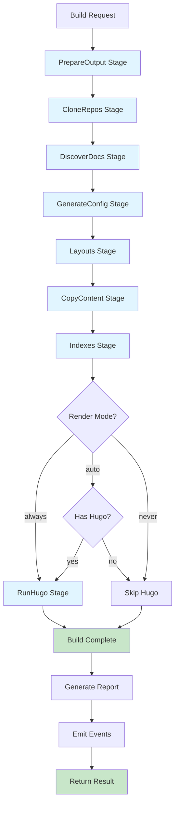
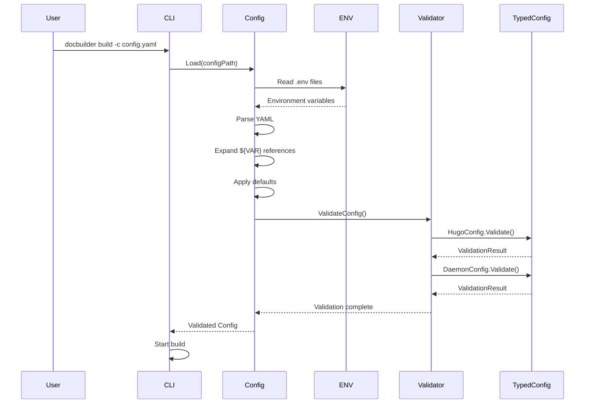
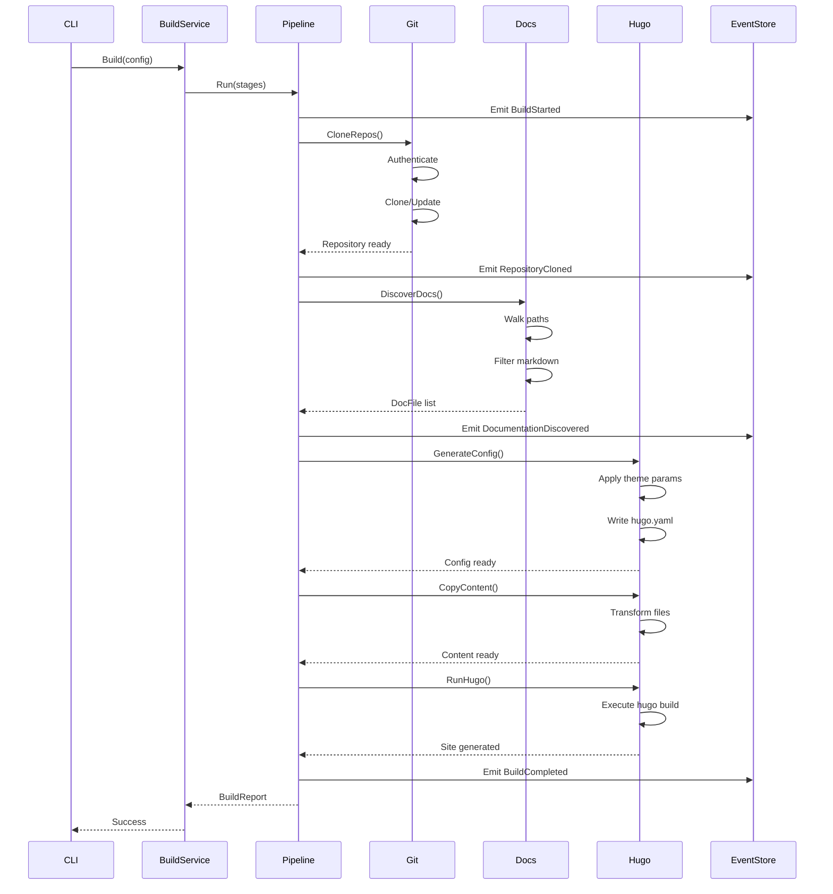
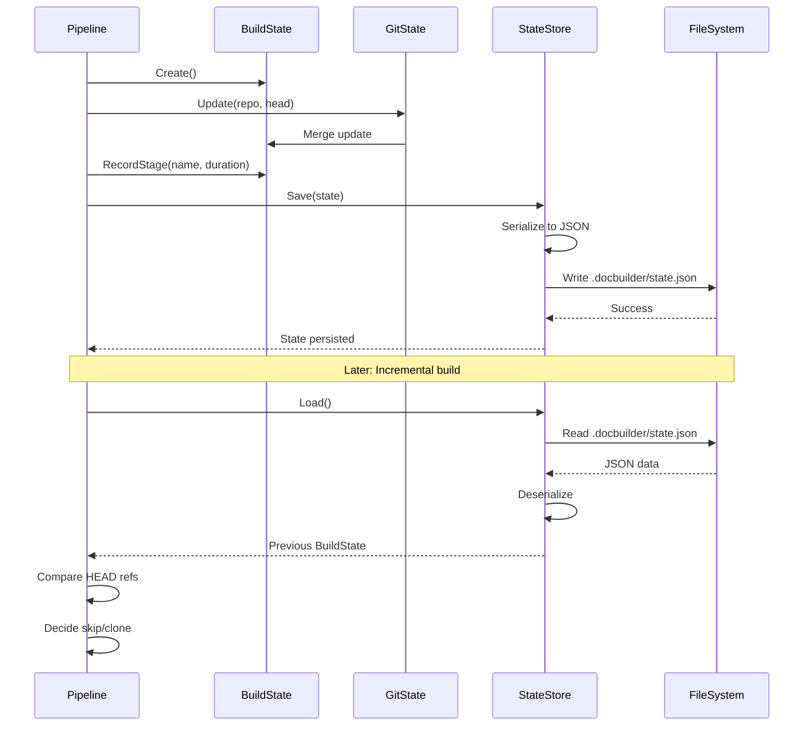
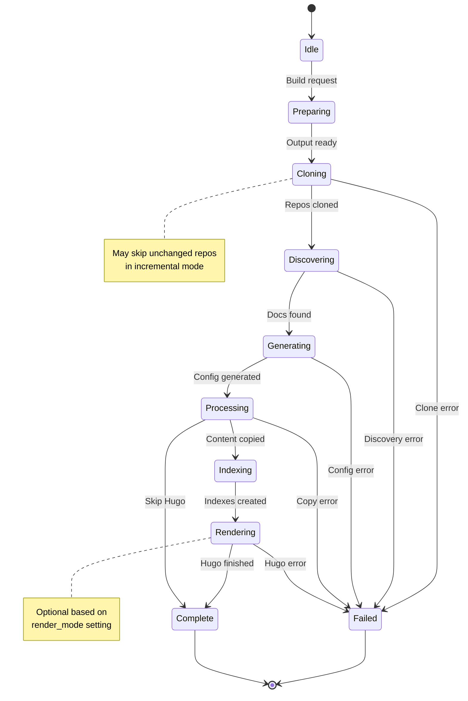
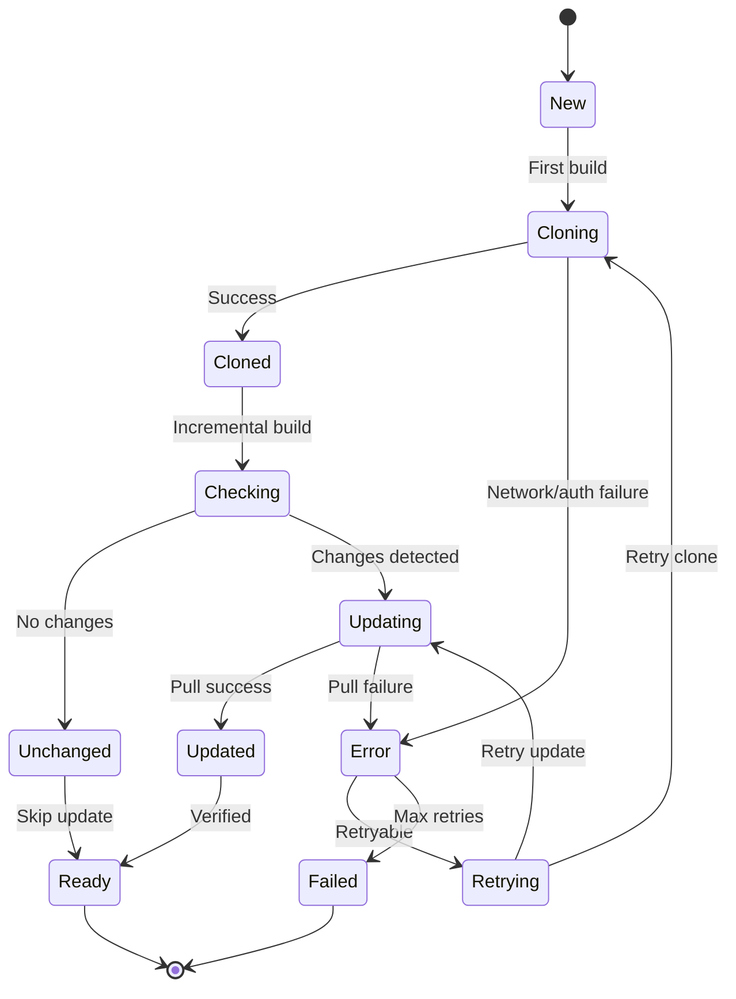
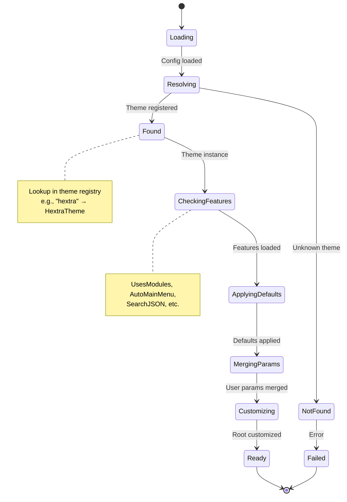

# Architecture Diagrams

> **⚠️ DEPRECATION NOTICE**: This document is partially outdated and requires significant updates to reflect the current transform-based architecture. Many package references (`cli/`, `pipeline/`, `services/`) no longer exist. The layer view diagram has been updated, but other sections still reference old architecture. See [architecture.md](architecture.md) and [functional-specification.md](../reference/functional-specification.md) for current information.

This document provides visual representations of DocBuilder's architecture using ASCII diagrams and Mermaid notation.

## Table of Contents

1. [High-Level System Architecture](#high-level-system-architecture)
2. [Pipeline Flow](#pipeline-flow)
3. [Package Dependencies](#package-dependencies)
4. [Data Flow](#data-flow)
5. [Component Interactions](#component-interactions)
6. [State Machine Diagrams](#state-machine-diagrams)

---

## High-Level System Architecture

### Layer View

```
┌──────────────────────────────────────────────────────────────────┐
│                      COMMAND LAYER                               │
│              (cmd/docbuilder/commands/)                          │
│                                                                  │
│  ┌──────────┐  ┌──────────┐  ┌──────────┐  ┌──────────────────┐  │
│  │  Build   │  │  Daemon  │  │  Preview │  │     Discover     │  │
│  │  (Kong)  │  │ (Watch)  │  │  (Live)  │  │   (Analysis)     │  │
│  └────┬─────┘  └────┬─────┘  └────┬─────┘  └────────┬─────────┘  │
│       │             │             │                 │            │
└───────┼─────────────┼─────────────┼─────────────────┼────────────┘
        │             │             │                 │
        └─────────────┴─────────────┴─────────────────┘
                      │
┌─────────────────────▼───────────────────────────────────────────┐
│                    SERVICE LAYER                                │
│             (internal/build, internal/daemon)                   │
│                                                                 │
│  ┌────────────────┐  ┌─────────────────┐  ┌──────────────────┐  │
│  │ BuildService   │  │ DaemonService   │  │ DiscoveryService │  │
│  │                │  │                 │  │                  │  │
│  │ - Run()        │  │ - Start()       │  │ - Discover()     │  │
│  │ - Validate()   │  │ - Stop()        │  │ - Report()       │  │
│  └────────┬───────┘  └────────┬────────┘  └────────┬─────────┘  │
│           │                   │                    │            │
└───────────┼───────────────────┼────────────────────┼────────────┘
            │                   │                    │
            └───────────────────┴────────────────────┘
                                │
┌───────────────────────────────▼─────────────────────────────────────┐
│                        PROCESSING LAYER                             │
│  (internal/hugo, internal/docs, internal/hugo/transforms)           │
│                                                                     │
│  ┌──────────────────────────────────────────────────────────────┐   │
│  │                   Hugo Generator                             │   │
│  │                                                              │   │
│  │  ┌─────────────┐ ┌─────────────┐ ┌─────────────────────┐     │   │
│  │  │  Transform  │ │   Theme     │ │   Report Builder    │     │   │
│  │  │  Registry   │ │   System    │ │                     │     │   │
│  │  └──────┬──────┘ └──────┬──────┘ └──────────┬──────────┘     │   │
│  └─────────┼───────────────┼───────────────────┼────────────────┘   │
│            │               │                   │                    │
│  ┌─────────▼───────────────▼───────────────────▼──────────────┐     │
│  │                  Transform Pipeline                       │     │
│  │                                                          │     │
│  │  Parse → Build → Enrich → Merge → Transform →            │     │
│  │  Finalize → Serialize                                    │     │
│  └──────────────────────────────────────────────────────────┘     │
└─────────────────────────────────┬───────────────────────────────────┘
                                  │
┌─────────────────────────────────▼────────────────────────────────┐
│                          DOMAIN LAYER                            │
│  (internal/config, internal/state, internal/docs)                │
│                                                                  │
│  ┌──────────┐  ┌──────────┐  ┌──────────┐  ┌──────────────────┐  │
│  │  Config  │  │  State   │  │ DocFile  │  │  Repository      │  │
│  │          │  │          │  │          │  │                  │  │
│  │ - Hugo   │  │ - Git    │  │ - Path   │  │ - URL            │  │
│  │ - Build  │  │ - Docs   │  │ - Trans  │  │ - Branch         │  │
│  │ - Forge  │  │ - Build  │  │   forms  │  │ - Auth           │  │
│  └────┬─────┘  └────┬─────┘  └────┬─────┘  └────────┬─────────┘  │
└───────┼─────────────┼─────────────┼─────────────────┼────────────┘
        │             │             │                 │
        └─────────────┴─────────────┴─────────────────┘
                      │
┌─────────────────────▼───────────────────────────────────────────┐
│                    INFRASTRUCTURE LAYER                         │
│  (internal/git, internal/forge, internal/workspace)             │
│                                                                 │
│  ┌──────────┐  ┌──────────┐  ┌──────────┐  ┌─────────────────┐  │
│  │   Git    │  │  Forge   │  │ Event    │  │  Workspace      │  │
│  │  Client  │  │ Clients  │  │ Store    │  │  Manager        │  │
│  │          │  │          │  │          │  │                 │  │
│  │ - Clone  │  │ - GitHub │  │ - Append │  │ - Create()      │  │
│  │ - Update │  │ - GitLab │  │ - Query  │  │ - Cleanup()     │  │
│  │ - Auth   │  │ - Forgejo│  │          │  │                 │  │
│  └────┬─────┘  └────┬─────┘  └────┬─────┘  └────────┬────────┘  │
│       │             │             │                 │           │
│       └─────────────┴─────────────┴─────────────────┘           │
│                             │                                   │
│                    ┌────────▼────────┐                          │
│                    │   Foundation    │                          │
│                    │     Errors      │                          │
│                    │                 │                          │
│                    │ - ClassifiedErr │                          │
│                    │ - Categories    │                          │
│                    │ - Retry Logic   │                          │
│                    └─────────────────┘                          │
└─────────────────────────────────────────────────────────────────┘
```

---

## Pipeline Flow

### Sequential Stage Execution



### Stage Detail: CloneRepos

```
CloneRepos Stage
    │
    ├─ For each repository config:
    │   │
    │   ├─ 1. Authenticate
    │   │   ├─ SSH Key
    │   │   ├─ Token
    │   │   └─ Basic Auth
    │   │
    │   ├─ 2. Check Incremental
    │   │   ├─ Compare HEAD ref
    │   │   ├─ Check doc hash
    │   │   └─ Skip if unchanged
    │   │
    │   ├─ 3. Clone or Update
    │   │   ├─ git clone (first time)
    │   │   └─ git pull (update)
    │   │
    │   ├─ 4. Read HEAD
    │   │   └─ Store ref in state
    │   │
    │   └─ 5. Emit Event
    │       ├─ RepositoryCloned
    │       └─ RepositoryUpdated
    │
    └─ Update GitState
```

### Stage Detail: CopyContent

```
CopyContent Stage
    │
    ├─ For each DocFile:
    │   │
    │   ├─ 1. Parse Front Matter
    │   │   ├─ Extract YAML header
    │   │   └─ Parse content
    │   │
    │   ├─ 2. Build Front Matter
    │   │   ├─ Add repository
    │   │   ├─ Add section
    │   │   ├─ Add forge
    │   │   └─ Add date
    │   │
    │   ├─ 3. Inject Edit Link
    │   │   ├─ Check forge capabilities
    │   │   ├─ Build edit URL
    │   │   └─ Add to front matter
    │   │
    │   ├─ 4. Merge Front Matter
    │   │   ├─ Combine parsed + built
    │   │   └─ User values override
    │   │
    │   ├─ 5. Apply Transforms
    │   │   ├─ Custom transformers
    │   │   └─ Replace patterns
    │   │
    │   ├─ 6. Serialize Front Matter
    │   │   ├─ Generate YAML
    │   │   └─ Combine with content
    │   │
    │   └─ 7. Write to content/
    │       └─ Create target file
    │
    └─ Update DocsState
```

---

## Package Dependencies

### Dependency Graph

```
┌──────────┐
│   cmd/   │─────────────────────┐
└────┬─────┘                     │
     │                           ▼
     │                    ┌──────────┐
     │                    │   cli/   │
     │                    └────┬─────┘
     │                         │
     ▼                         ▼
┌─────────────┐        ┌──────────────┐
│  services/  │◄───────│   server/    │
└──────┬──────┘        └──────────────┘
       │
       ▼
┌──────────────┐
│  pipeline/   │
└──────┬───────┘
       │
       ├────────────────────────────────┐
       │                                │
       ▼                                ▼
┌──────────────┐                 ┌──────────────┐
│    config/   │                 │    state/    │
└──────┬───────┘                 └──────┬───────┘
       │                                │
       ├────────────────────────────────┤
       │                                │
       ▼                                ▼
┌────────────────────────────────────────────┐
│              Domain Layer                  │
│  ┌─────────┐  ┌─────────┐  ┌────────────┐  │
│  │  docs/  │  │  hugo/  │  │    forge/  │  │
│  └────┬────┘  └────┬────┘  └─────┬──────┘  │
└───────┼────────────┼─────────────┼─────────┘
        │            │             │
        └────────────┴─────────────┘
                     │
        ┌────────────┴─────────────┐
        │                          │
        ▼                          ▼
┌──────────────┐          ┌──────────────┐
│     git/     │          │  workspace/  │
└──────┬───────┘          └──────┬───────┘
       │                         │
       └─────────────┬───────────┘
                     │
                     ▼
             ┌──────────────┐
             │ foundation/  │
             │   errors/    │
             └──────────────┘
```

### Import Rules

**Layer Dependencies (must respect):**
```
presentation  →  application  →  domain  →  infrastructure
     ✓               ✓             ✓            ✓
     ✗               ✗             ✗            ✓
```

**Package Rules:**
- ✅ `cli/` can import `services/`
- ✅ `services/` can import `pipeline/`
- ✅ `pipeline/` can import `config/`, `state/`, `docs/`, `hugo/`, `git/`
- ✅ `docs/` can import `config/`
- ✅ All packages can import `foundation/`
- ❌ `config/` cannot import `pipeline/`
- ❌ `git/` cannot import `services/`
- ❌ `foundation/` cannot import application packages

---

## Data Flow

### Configuration Loading



### Build Execution



### State Persistence



---

## Component Interactions

### Theme System

```
┌────────────────────────────────────────────────────┐
│              Theme Registry                        │
│                                                    │
│  themes = map[string]Theme{                        │
│    "hextra": &HextraTheme{},                       │
│    "docsy":  &DocsyTheme{},                        │
│  }                                                 │
└─────────────────┬──────────────────────────────────┘
                  │
                  │ GetTheme(name)
                  ▼
         ┌───────────────────┐
         │  Theme Instance   │ 
         │                   │
         │ - Name()          │
         │ - Features()      │
         │ - ApplyParams()   │
         │ - CustomizeRoot() │
         └────────┬──────────┘
                  │
    ┌─────────────┼─────────────┐
    │             │             │
    ▼             ▼             ▼
┌────────┐  ┌─────────┐  ┌──────────┐
│Hextra  │  │ Docsy   │  │ Custom   │
│Theme   │  │ Theme   │  │ Theme    │
└────────┘  └─────────┘  └──────────┘

Generation Flow:
1. Load config.hugo.theme → "hextra"
2. GetTheme("hextra") → HextraTheme
3. HextraTheme.Features() → {UsesModules: true, ...}
4. Core defaults → {title, baseURL, markup}
5. HextraTheme.ApplyParams(ctx, params)
6. User params deep merge
7. HextraTheme.CustomizeRoot(ctx, root)
8. Write hugo.yaml
```

### Forge Integration

```
┌──────────────────────────────────────────────┐
│           Forge Factory                      │
│                                              │
│  NewForge(config) → Forge                    │
└──────────────┬───────────────────────────────┘
               │
               │ Based on config.type
               │
    ┌──────────┼──────────┐
    │          │          │
    ▼          ▼          ▼
┌────────┐ ┌────────┐ ┌─────────┐
│GitHub  │ │GitLab  │ │Forgejo  │
│Client  │ │Client  │ │Client   │
└───┬────┘ └───┬────┘ └────┬────┘
    │          │           │
    └──────────┴───────────┘
               │
               │ All compose
               ▼
        ┌─────────────┐
        │ BaseForge   │
        │             │
        │ HTTP Client │
        │ Auth Header │
        │ Base URL    │
        └──────┬──────┘
               │
               │ Uses
               ▼
        ┌─────────────┐
        │http.Client  │
        │             │
        │- Timeout    │
        │- TLS Config │
        │- Transport  │
        └─────────────┘

Operation Flow:
1. Config specifies forge type: "github"
2. NewForge(config) creates GitHubClient
3. GitHubClient embeds BaseForge
4. BaseForge.NewRequest(method, path)
5. Add auth header: "Authorization: Bearer {token}"
6. Add custom headers: "X-GitHub-Api-Version: 2022-11-28"
7. BaseForge.DoRequest(req)
8. Parse response
9. Return Repository, error
```

### Change Detection

```
┌──────────────────────────────────────────────────┐
│          Change Detector                         │
└──────────────┬───────────────────────────────────┘
               │
               │ DetectChanges(repos)
               ▼
    ┌──────────────────────┐
    │  Load Previous State │
    │  - HEAD refs         │
    │  - Doc hashes        │
    └──────────┬───────────┘
               │
               ▼
    ┌──────────────────────┐
    │  For each repository │
    └──────────┬───────────┘
               │
               ├─ Level 1: HEAD Comparison
               │  ├─ Read current HEAD
               │  ├─ Compare to previous
               │  └─ Changed? → Include
               │
               ├─ Level 2: Quick Hash
               │  ├─ Hash directory tree
               │  ├─ Compare to previous
               │  └─ Changed? → Include
               │
               ├─ Level 3: Doc Files Hash
               │  ├─ Discover docs
               │  ├─ Sort paths
               │  ├─ SHA-256 hash
               │  ├─ Compare to previous
               │  └─ Changed? → Include
               │
               └─ Level 4: Deletion Detection
                  ├─ Check removed files
                  └─ Deletions? → Include
               
               ▼
    ┌──────────────────────┐
    │    ChangeSet         │
    │                      │
    │ - ChangedRepos: []   │
    │ - SkippedRepos: []   │
    │ - Reasons: map[]     │
    └──────────────────────┘
```

---

## State Machine Diagrams

### Build State Machine



### Repository State



### Theme Loading



---

## Deployment Architecture

### Single Instance

```
┌────────────────────────────────────────┐
│          Server Host                   │
│                                        │
│  ┌───────────────────────────────────┐ │
│  │      DocBuilder Binary            │ │
│  │                                   │ │
│  │  ┌─────────┐      ┌────────────┐  │ │
│  │  │   CLI   │      │  Daemon    │  │ │
│  │  └─────────┘      └─────┬──────┘  │ │
│  │                         │         │ │
│  │                    ┌────▼─────┐   │ │
│  │                    │  Server  │   │ │
│  │                    │  :8080   │   │ │
│  │                    └──────────┘   │ │
│  └───────────────────────────────────┘ │
│                                        │
│  ┌───────────────────────────────────┐ │
│  │      Workspace                    │ │
│  │  /tmp/docbuilder-*/               │ │
│  └───────────────────────────────────┘ │
│                                        │
│  ┌───────────────────────────────────┐ │
│  │      State                        │ │
│  │  .docbuilder/state.json           │ │
│  └───────────────────────────────────┘ │
└────────────────────────────────────────┘
```

### High Availability

```
                    ┌──────────────┐
                    │ Load Balancer│
                    │   (nginx)    │
                    └──────┬───────┘
                           │
         ┌─────────────────┼────────────────┐
         │                 │                │
    ┌────▼────┐       ┌────▼────┐      ┌────▼────┐
    │ Worker 1│       │ Worker 2│      │ Worker 3│
    │         │       │         │      │         │
    │:8080    │       │:8080    │      │:8080    │
    └────┬────┘       └────┬────┘      └────┬────┘
         │                 │                │
         └─────────────────┼────────────────┘
                           │
                  ┌────────▼────────┐
                  │  Shared Storage │
                  │                 │
                  │  - Event Store  │
                  │  - State DB     │
                  │  - Output Files │
                  └─────────────────┘
```

---

## References

- [Comprehensive Architecture](comprehensive-architecture.md)
- [Architecture Overview](architecture.md)
- [Namespacing Rationale](namespacing-rationale.md)
- [Architecture Migration Plan](../../ARCHITECTURE_MIGRATION_PLAN.md)
