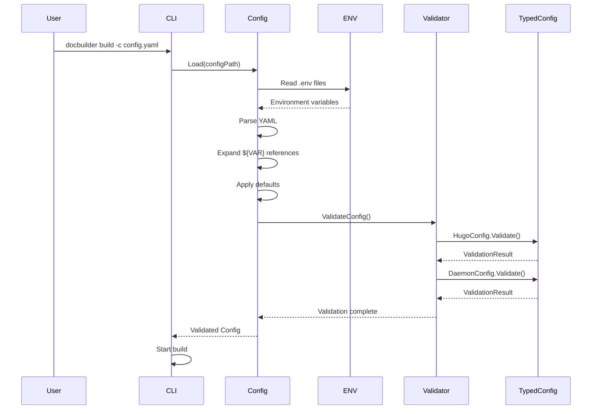
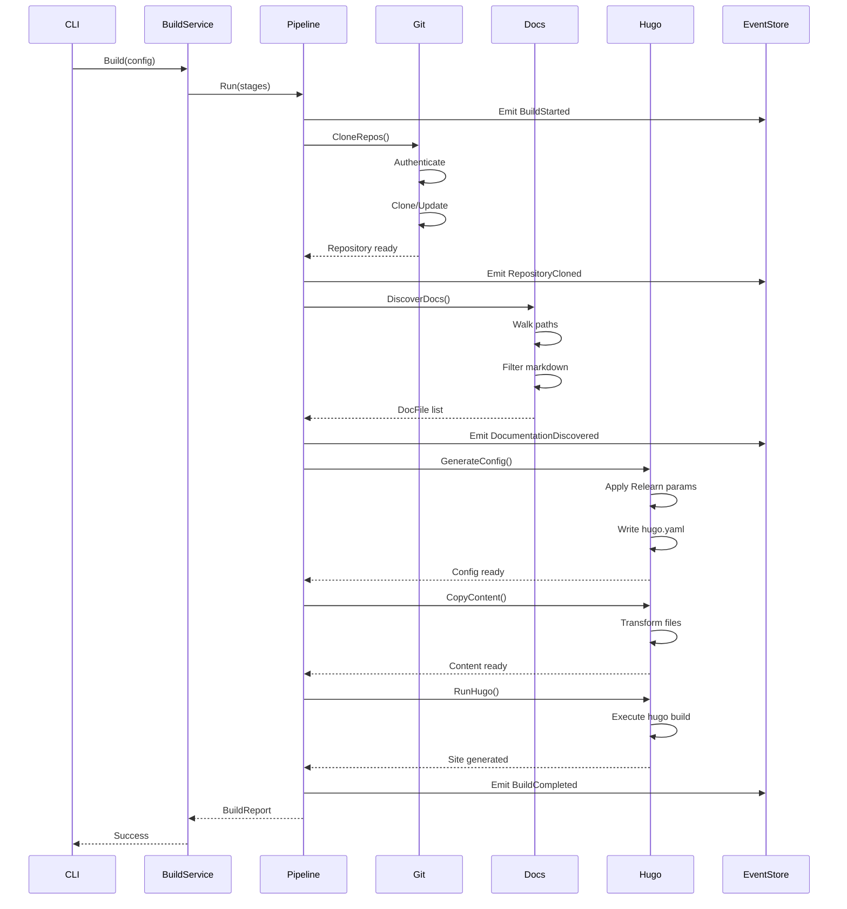
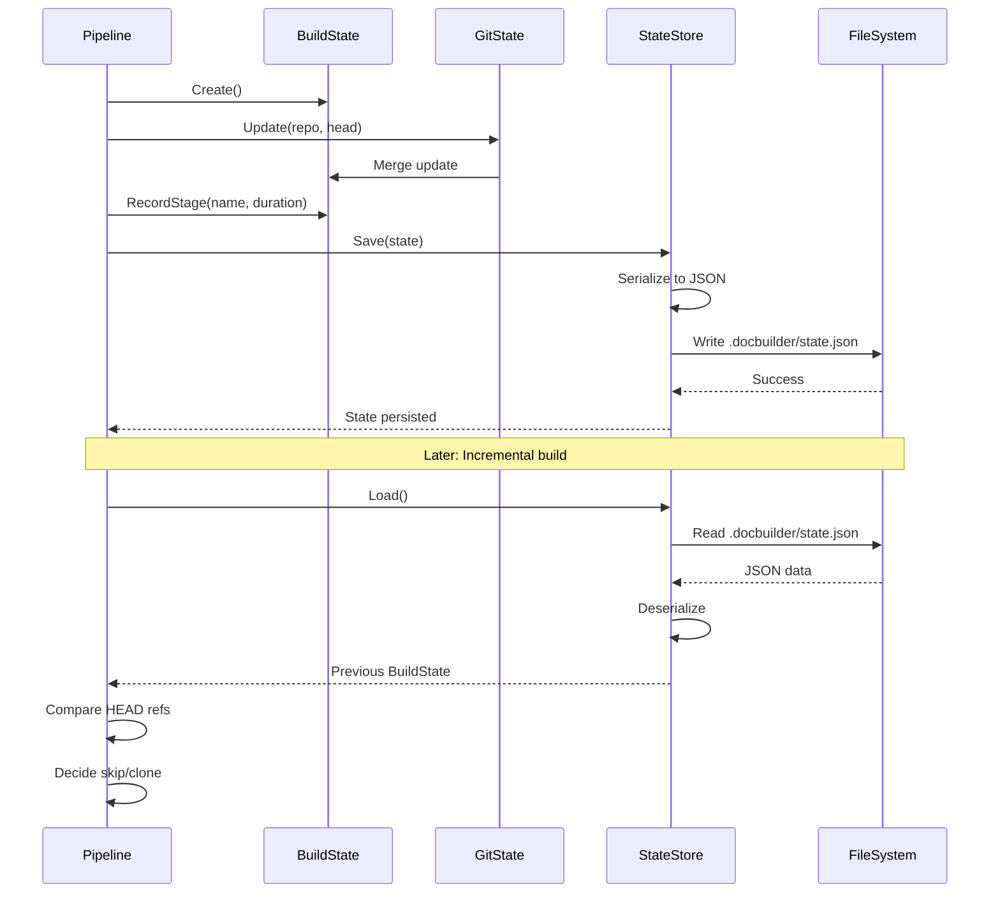

# Data Flow Diagrams

This document shows how data flows through DocBuilder during configuration loading, build execution, and state persistence.

**Last Updated:** January 4, 2026 - Reflects current implementation.

## Configuration Loading



### Configuration Loading Steps

1. **File Discovery**: Locate config file (explicit path or defaults)
2. **Environment Loading**: Read `.env` and `.env.local` files
3. **YAML Parsing**: Parse configuration file structure
4. **Variable Expansion**: Replace `${VAR}` with environment values
5. **Default Application**: Fill in missing optional fields
6. **Validation**: Check required fields, types, and constraints
7. **Type Coercion**: Convert to strongly-typed config structs

### Key Files
- `internal/config/config.go` - Main config loader
- `internal/config/typed/hugo_config.go` - Hugo configuration validation
- `internal/config/typed/daemon_config.go` - Daemon configuration validation

---

## Build Execution



### Build Flow Phases

**Phase 1: Initialization**
- BuildService receives config and output path
- Creates BuildState with initial values
- Prepares output directory

**Phase 2: Repository Operations**
- For each repository:
  - Authenticate with credentials
  - Clone or update repository
  - Record HEAD commit reference
  - Emit RepositoryCloned/Updated event

**Phase 3: Documentation Discovery**
- Walk configured documentation paths
- Filter for markdown files (.md, .markdown)
- Exclude standard files (README, CONTRIBUTING, etc.)
- Build list of DocFile objects
- Compute documentation set hash

**Phase 4: Hugo Configuration**
- Load theme defaults (Relearn)
- Merge user-provided parameters
- Add dynamic fields (build_date, version)
- Configure Hugo modules
- Write hugo.yaml

**Phase 5: Content Processing**
- For each DocFile:
  - Run 12-step transform pipeline
  - Write to Hugo content/ directory
- Generate static assets
- Update DocsState

**Phase 6: Index Generation**
- Create main site index (_index.md)
- Generate repository indexes
- Generate section indexes

**Phase 7: Rendering**
- Execute hugo command (if render_mode permits)
- Capture output and errors
- Count rendered pages

**Phase 8: Finalization**
- Atomic staging promotion
- Generate build report
- Emit BuildCompleted event
- Return result to CLI

### Key Files
- `internal/build/default_service.go` - Build orchestration
- `internal/hugo/generator.go` - Hugo site generation
- `internal/hugo/stages.go` - Stage execution

---

## State Persistence



### State Persistence Flow

**During Build**:
1. BuildState created with initial values
2. GitState updated after each repository clone
3. DocsState updated after discovery
4. PipelineState tracks execution metadata
5. State serialized to JSON
6. Written to `.docbuilder/state.json`

**Incremental Build**:
1. Load previous state from `.docbuilder/state.json`
2. Compare HEAD references for each repository
3. Compute documentation set hash
4. Skip unchanged repositories
5. Update only changed state

### State Components

**GitState**:
- `WorkspaceDir` - Temporary workspace path
- `Repositories` - List of configured repositories
- `Commits` - Map of repository → HEAD reference
- `CommitDates` - Map of repository → commit timestamp

**DocsState**:
- `Files` - Discovered DocFile list
- `IsSingleRepo` - Whether single repository mode
- `FilesByRepository` - Map of repository → files

**PipelineState**:
- `ConfigHash` - Configuration fingerprint
- `ExecutedStages` - List of completed stages

### Key Files
- `internal/state/git_state.go` - Git state management
- `internal/state/docs_state.go` - Documentation state
- `internal/state/pipeline_state.go` - Pipeline metadata

---

## Content Transform Flow

```
DocFile from Discovery
    │
    ├─ Original Path: docs/api/overview.md
    ├─ Repository: my-project
    └─ Section: api
    │
    ▼
┌──────────────────────────────────────┐
│   Pipeline Processor                 │
│   (internal/hugo/pipeline/)          │
└──────────────────┬───────────────────┘
                   │
                   ▼
        Create Document Object
                   │
        ┌──────────┴───────────┐
        │                      │
        │  Path: content/my-project/api/overview.md
        │  Content: (markdown)
        │  FrontMatter: (empty initially)
        │  Repository: my-project
        │  SourceURL: https://github.com/...
        │  SourceCommit: abc123
        │
        └──────────┬───────────┘
                   │
                   ▼
    ┌──────────────────────────────────┐
    │  Transform 1: parseFrontMatter   │
    │  - Extract existing YAML header  │
    │  - Parse into FrontMatter map    │
    └──────────────┬───────────────────┘
                   │
                   ▼
    ┌──────────────────────────────────┐
    │  Transform 2: normalizeIndexFiles│
    │  - If README.md → _index.md      │
    └──────────────┬───────────────────┘
                   │
                   ▼
    ┌──────────────────────────────────┐
    │  Transform 3: buildBaseFrontMatter│
    │  - Add title, date, repository   │
    │  - Add section metadata          │
    └──────────────┬───────────────────┘
                   │
                   ▼
              [8 more transforms...]
                   │
                   ▼
    ┌──────────────────────────────────┐
    │  Transform 12: serializeDocument │
    │  - Generate YAML front matter    │
    │  - Combine with content          │
    │  - Output: final byte array      │
    └──────────────┬───────────────────┘
                   │
                   ▼
        Final Hugo Content File
                   │
        ┌──────────┴───────────┐
        │                      │
        │  ---
        │  title: "API Overview"
        │  date: 2026-01-04
        │  repository: my-project
        │  section: api
        │  sourceURL: https://...
        │  sourceCommit: abc123
        │  editURL: https://.../edit/...
        │  ---
        │  
        │  # API Overview
        │  (content...)
        │
        └──────────────────────┘
```

### Transform Pipeline Data Flow

Each transform:
1. Receives `Document` object
2. Reads current state (Path, Content, FrontMatter)
3. Modifies one or more fields
4. Returns modified `Document`
5. May generate additional documents (e.g., @glossary)

Transforms are **idempotent**: Running twice produces same result.

### Key Files
- `internal/hugo/pipeline/processor.go` - Pipeline orchestration
- `internal/hugo/pipeline/document.go` - Document model
- `internal/hugo/pipeline/transform_*.go` - Individual transforms

---

## Repository Metadata Flow

```
Git Clone/Update
    │
    ├─ Repository URL: https://github.com/user/repo.git
    ├─ Branch: main
    └─ Commit: abc123def456
    │
    ▼
Read HEAD Reference
    │
    └─ HEAD: abc123def456
    │
    ▼
Extract Commit Metadata
    │
    ├─ Commit SHA: abc123def456
    ├─ Commit Date: 2026-01-04T10:30:00Z
    ├─ Author: user@example.com
    └─ Message: "Update documentation"
    │
    ▼
Store in BuildState.GitState
    │
    ├─ Commits["my-repo"] = "abc123def456"
    └─ CommitDates["my-repo"] = "2026-01-04T10:30:00Z"
    │
    ▼
Inject into Pipeline
    │
    └─ RepositoryInfo map passed to Processor
    │
    ▼
Added to Each Document
    │
    ├─ doc.SourceURL = "https://github.com/user/repo.git"
    ├─ doc.SourceCommit = "abc123def456"
    ├─ doc.CommitDate = "2026-01-04T10:30:00Z"
    └─ doc.SourceBranch = "main"
    │
    ▼
Serialized to Front Matter
    │
    └─ Front matter fields:
        - sourceURL: https://...
        - sourceCommit: abc123...
        - commitDate: 2026-01-04...
        - sourceBranch: main
```

### Metadata Sources

1. **Git Repository**: Clone operation provides URL, branch
2. **Git HEAD**: Read commit provides SHA and timestamp
3. **Forge API**: (Optional) Additional metadata from GitHub/GitLab API
4. **Configuration**: Repository name, paths, authentication

### Key Files
- `internal/git/git.go` - Git operations
- `internal/hugo/generator.go` - Metadata collection
- `internal/hugo/pipeline/transform_metadata.go` - Metadata injection

---

## Event Emission Flow

```
Build Stage Execution
    │
    ├─ Stage starts
    │   └─ Emit StageStarted event
    │
    ├─ Repository cloned
    │   └─ Emit RepositoryCloned event
    │
    ├─ Documents discovered
    │   └─ Emit DocumentationDiscovered event
    │
    ├─ Config generated
    │   └─ Emit ConfigGenerated event
    │
    ├─ Content copied
    │   └─ Emit ContentCopied event
    │
    ├─ Hugo executed
    │   └─ Emit HugoExecuted event
    │
    └─ Build complete
        └─ Emit BuildCompleted event
        │
        ▼
    Event Store
        │
        ├─ Append to event log
        ├─ Update statistics
        └─ Trigger observers
        │
        ▼
    Observers (Optional)
        │
        ├─ Metrics collector
        ├─ LiveReload notifier
        └─ Build status updater
```

### Event Types

**Build Lifecycle**:
- `BuildStarted` - Build begins
- `BuildCompleted` - Build finishes successfully
- `BuildFailed` - Build encounters error

**Repository Events**:
- `RepositoryCloned` - Fresh clone completed
- `RepositoryUpdated` - Git pull completed
- `RepositorySkipped` - No changes detected

**Documentation Events**:
- `DocumentationDiscovered` - Files found
- `DocumentTransformed` - File processed
- `IndexGenerated` - Index page created

**Configuration Events**:
- `ConfigGenerated` - hugo.yaml written
- `ConfigValidated` - Configuration passed validation

### Key Files
- `internal/eventstore/` - Event storage and emission
- `internal/hugo/stages.go` - Event emission points

---

## Change Detection Flow

```
Incremental Build Request
    │
    ▼
Load Previous BuildState
    │
    ├─ Read .docbuilder/state.json
    ├─ Deserialize GitState
    └─ Deserialize DocsState
    │
    ▼
For Each Repository:
    │
    ├─ Level 1: HEAD Comparison
    │   ├─ Fetch remote HEAD
    │   ├─ Compare to previous HEAD
    │   └─ Different? → Changed
    │
    ├─ Level 2: Quick Hash
    │   ├─ Hash directory tree
    │   ├─ Compare to previous
    │   └─ Different? → Changed
    │
    ├─ Level 3: Doc Files Hash
    │   ├─ Discover docs
    │   ├─ Sort paths
    │   ├─ SHA-256 hash
    │   ├─ Compare to previous
    │   └─ Different? → Changed
    │
    └─ Level 4: Deletion Detection
        ├─ Check removed files
        └─ Deletions? → Changed
    │
    ▼
Build ChangeSet
    │
    ├─ ChangedRepos: [repo1, repo3]
    ├─ SkippedRepos: [repo2]
    └─ Reasons: {repo2: "no changes"}
    │
    ▼
Clone/Update Only Changed Repos
```

### Change Detection Levels

**Level 1: HEAD Comparison** (fastest)
- Fetch remote HEAD reference
- Compare to stored HEAD
- Skip if identical
- **Cost**: Single network request per repository

**Level 2: Quick Hash** (fast)
- Hash directory tree structure
- Compare to previous hash
- Detect added/removed directories
- **Cost**: File system scan

**Level 3: Doc Files Hash** (medium)
- Discover all documentation files
- Sort by path
- Compute SHA-256 hash
- Compare to previous
- **Cost**: File content reading

**Level 4: Deletion Detection** (thorough)
- Compare current files to previous
- Detect removed files
- Require rebuild if deletions found
- **Cost**: Full file list comparison

### Key Files
- `internal/hugo/doc_changes.go` - Change detection logic
- `internal/git/git.go` - HEAD reference checking

---

## References

- [Pipeline Flow Diagrams](pipeline-flow.md)
- [State Machine Diagrams](state-machines.md)
- [High-Level System Architecture](high-level-architecture.md)
