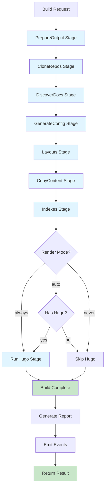

---
categories:
    - explanation
    - architecture
date: 2026-01-04T00:00:00Z
id: 4429e342-be38-43e0-9ced-914cdf9329ff
tags:
    - pipeline
    - stages
    - workflow
title: Pipeline Flow Diagrams
---

# Pipeline Flow Diagrams

This document visualizes the sequential execution flow of DocBuilder's build pipeline and the detailed operations within key stages.

**Last Updated:** January 4, 2026 - Reflects current pipeline implementation with 12-step transform pipeline.

## Sequential Stage Execution



## Stage Detail: PrepareOutput

```
PrepareOutput Stage
    │
    ├─ 1. Create Output Directory
    │   └─ Ensure output dir exists
    │
    ├─ 2. Initialize Workspace
    │   └─ Create workspace dir for git operations
    │
    ├─ 3. Create Hugo Structure
    │   ├─ content/
    │   ├─ static/
    │   ├─ layouts/
    │   ├─ archetypes/
    │   └─ data/
    │
    └─ 4. Clean Previous Build (if configured)
        └─ Remove old content files
```

**Implementation**: `internal/hugo/stage_prepare.go`

## Stage Detail: CloneRepos

```
CloneRepos Stage
    │
    ├─ For each repository config:
    │   │
    │   ├─ 1. Authenticate
    │   │   ├─ SSH Key
    │   │   ├─ Token
    │   │   └─ Basic Auth
    │   │
    │   ├─ 2. Check Incremental
    │   │   ├─ Compare HEAD ref
    │   │   ├─ Check doc hash
    │   │   └─ Skip if unchanged
    │   │
    │   ├─ 3. Clone or Update
    │   │   ├─ git clone (first time)
    │   │   └─ git pull (update)
    │   │
    │   ├─ 4. Read HEAD
    │   │   └─ Store ref in state
    │   │
    │   └─ 5. Emit Event
    │       ├─ RepositoryCloned
    │       └─ RepositoryUpdated
    │
    └─ Update GitState
```

**Implementation**: `internal/hugo/stage_clone.go`

## Stage Detail: DiscoverDocs

```
DiscoverDocs Stage
    │
    ├─ For each cloned repository:
    │   │
    │   ├─ 1. Walk Configured Paths
    │   │   └─ Paths from repository config
    │   │
    │   ├─ 2. Filter Files
    │   │   ├─ Accept: *.md, *.markdown
    │   │   └─ Ignore: README, CONTRIBUTING, CHANGELOG, LICENSE
    │   │
    │   ├─ 3. Build DocFile List
    │   │   ├─ Source path
    │   │   ├─ Hugo path (destination)
    │   │   ├─ Repository name
    │   │   └─ Section path
    │   │
    │   └─ 4. Compute Hash
    │       ├─ Sort paths
    │       ├─ SHA-256 hash
    │       └─ Store in BuildState
    │
    └─ Update DocsState
```

**Implementation**: `internal/hugo/stage_discover.go`

**Key File**: `internal/docs/discovery.go` handles file walking and filtering

## Stage Detail: GenerateConfig

```
GenerateConfig Stage
    │
    ├─ 1. Compute Config Hash
    │   ├─ Hash title, baseURL, params
    │   └─ Store for change detection
    │
    ├─ 2. Build Core Configuration
    │   ├─ Title, description, baseURL
    │   ├─ Language settings
    │   └─ Markup configuration
    │
    ├─ 3. Apply Relearn Defaults
    │   ├─ themeVariant: ["auto", "zen-light", "zen-dark"]
    │   ├─ collapsibleMenu: true
    │   ├─ showVisitedLinks: true
    │   ├─ mermaid.enable: true
    │   └─ math.enable: true
    │
    ├─ 4. Merge User Parameters
    │   └─ Deep merge user-provided hugo.params
    │
    ├─ 5. Add Dynamic Fields
    │   ├─ build_date (timestamp)
    │   └─ version metadata
    │
    ├─ 6. Configure Hugo Modules
    │   ├─ Create/update go.mod
    │   └─ Import github.com/McShelby/hugo-theme-relearn
    │
    └─ 7. Write hugo.yaml
        └─ Serialize to output directory
```

**Implementation**: `internal/hugo/stage_generate_config.go`, `internal/hugo/config_writer.go`

## Stage Detail: CopyContent

```
CopyContent Stage
    │
    ├─ For each DocFile:
    │   │
    │   ├─ Fixed Transform Pipeline (12 sequential transforms)
    │   │   │
    │   │   ├─ 1. Parse Front Matter
    │   │   │   ├─ Extract YAML header (--- delimited)
    │   │   │   └─ Parse markdown content
    │   │   │
    │   │   ├─ 2. Normalize Index Files
    │   │   │   └─ README.md → _index.md
    │   │   │
    │   │   ├─ 3. Build Base Front Matter
    │   │   │   ├─ Add repository metadata
    │   │   │   ├─ Add section/path info
    │   │   │   ├─ Add forge info
    │   │   │   └─ Add date/timestamp
    │   │   │
    │   │   ├─ 4. Extract Index Title
    │   │   │   ├─ Find first H1 heading
    │   │   │   └─ Set as page title (if _index.md)
    │   │   │
    │   │   ├─ 5. Strip Heading
    │   │   │   └─ Remove first H1 from content (if extracted as title)
    │   │   │
    │   │   ├─ 6. Escape Shortcodes in Code Blocks
    │   │   │   └─ Prevent Hugo from processing {{ }} inside ```
    │   │   │
    │   │   ├─ 7. Rewrite Relative Links
    │   │   │   ├─ Fix .md → / conversions
    │   │   │   └─ Resolve relative paths
    │   │   │
    │   │   ├─ 8. Rewrite Image Links
    │   │   │   └─ Fix image path references
    │   │   │
    │   │   ├─ 9. Generate from Keywords
    │   │   │   └─ Process @keywords directives (e.g., @glossary)
    │   │   │
    │   │   ├─ 10. Add Repository Metadata
    │   │   │   ├─ sourceURL
    │   │   │   ├─ sourceCommit
    │   │   │   └─ sourceBranch
    │   │   │
    │   │   ├─ 11. Add Edit Link
    │   │   │   ├─ Check forge capabilities
    │   │   │   ├─ Build edit URL
    │   │   │   └─ Add to front matter
    │   │   │
    │   │   └─ 12. Serialize Document
    │   │       ├─ Generate YAML front matter
    │   │       └─ Combine with markdown content
    │   │
    │   └─ Write to content/
    │       ├─ Create target directory
    │       └─ Write processed file
    │
    ├─ Generate Static Assets
    │   └─ View Transitions API assets (if enabled)
    │
    └─ Update DocsState
```

**Implementation**: 
- Stage: `internal/hugo/stage_copy_content.go`
- Pipeline: `internal/hugo/pipeline/processor.go`
- Transforms: `internal/hugo/pipeline/transform_*.go`

## Stage Detail: Indexes

```
Indexes Stage
    │
    ├─ 1. Generate Main Index
    │   ├─ Create content/_index.md
    │   ├─ List all repositories
    │   └─ Add site-wide metadata
    │
    ├─ 2. Generate Repository Indexes
    │   ├─ For each repository:
    │   │   ├─ Create content/{repo}/_index.md
    │   │   ├─ List sections
    │   │   └─ Add repository metadata
    │
    └─ 3. Generate Section Indexes
        └─ For each section without _index.md:
            ├─ Create content/{repo}/{section}/_index.md
            ├─ List files in section
            └─ Add section metadata
```

**Implementation**: `internal/hugo/stage_indexes.go`, `internal/hugo/indexes.go`

**Key Functions**:
- `generateMainIndex` - Site home page
- `generateRepositoryIndex` - Per-repository landing pages
- `generateSectionIndex` - Section navigation pages

## Stage Detail: RunHugo

```
RunHugo Stage
    │
    ├─ 1. Check Render Mode
    │   ├─ always: Always run Hugo
    │   ├─ auto: Run if hugo command exists
    │   └─ never: Skip Hugo execution
    │
    ├─ 2. Detect Hugo Binary
    │   └─ Check PATH for hugo command
    │
    ├─ 3. Execute Hugo Build
    │   ├─ Run: hugo --source {staging_dir}
    │   ├─ Capture stdout/stderr
    │   └─ Check exit code
    │
    ├─ 4. Handle Errors
    │   ├─ Parse Hugo error messages
    │   ├─ Classify errors (build/template/content)
    │   └─ Add to BuildReport
    │
    └─ 5. Count Rendered Pages
        └─ Track pages in BuildReport
```

**Implementation**: `internal/hugo/stage_run_hugo.go`, `internal/hugo/renderer.go`

## Pipeline Execution Flow

```
┌─────────────────────────────────────────────────┐
│           Pipeline Runner                       │
│           (internal/hugo/stages.go)             │
└─────────────────┬───────────────────────────────┘
                  │
                  ▼
         ┌────────────────┐
         │  For each stage │
         └────────┬───────┘
                  │
        ┌─────────┴─────────┐
        │                   │
        ▼                   ▼
   ┌─────────┐      ┌─────────────┐
   │ Execute │      │ Record Time │
   │  Stage  │      │  & Outcome  │
   └────┬────┘      └──────┬──────┘
        │                  │
        │    ┌─────────────┘
        │    │
        ▼    ▼
   ┌──────────────┐
   │ Update State │
   │  & Report    │
   └──────┬───────┘
          │
          ▼
   ┌────────────────┐
   │  Emit Event    │
   │  (Optional)    │
   └────────────────┘
```

## Error Handling in Pipeline

```
Stage Execution
    │
    ├─ Execute Stage Function
    │   │
    │   ├─ Success
    │   │   ├─ Record duration
    │   │   ├─ Update state
    │   │   └─ Continue to next stage
    │   │
    │   └─ Failure
    │       ├─ Classify error (foundation/errors)
    │       ├─ Record in BuildReport
    │       ├─ Abort staging
    │       └─ Return error
    │
    └─ Context Cancellation
        ├─ Detect ctx.Done()
        ├─ Stop execution
        └─ Return context.Canceled
```

## References

- [High-Level System Architecture](high-level-architecture.md)
- [Data Flow Diagrams](data-flow.md)
- [State Machine Diagrams](state-machines.md)
- [Build Service Documentation](../../../internal/build/)
- [Hugo Generator Documentation](../../../internal/hugo/)
