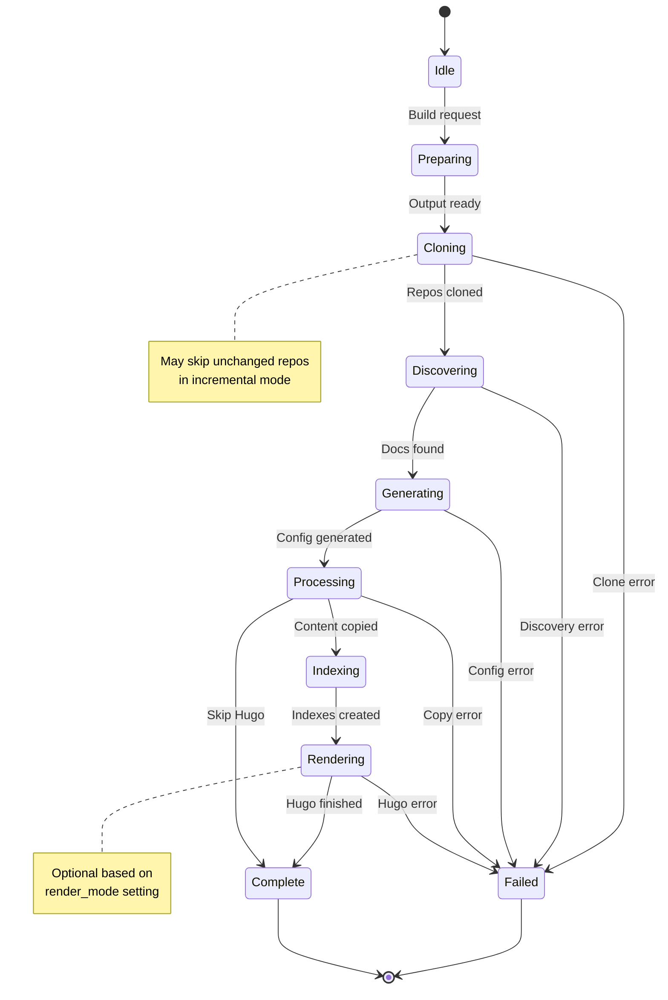
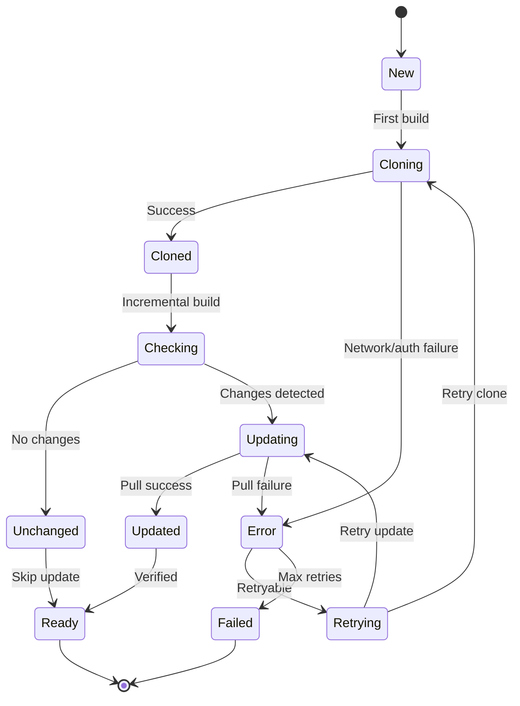
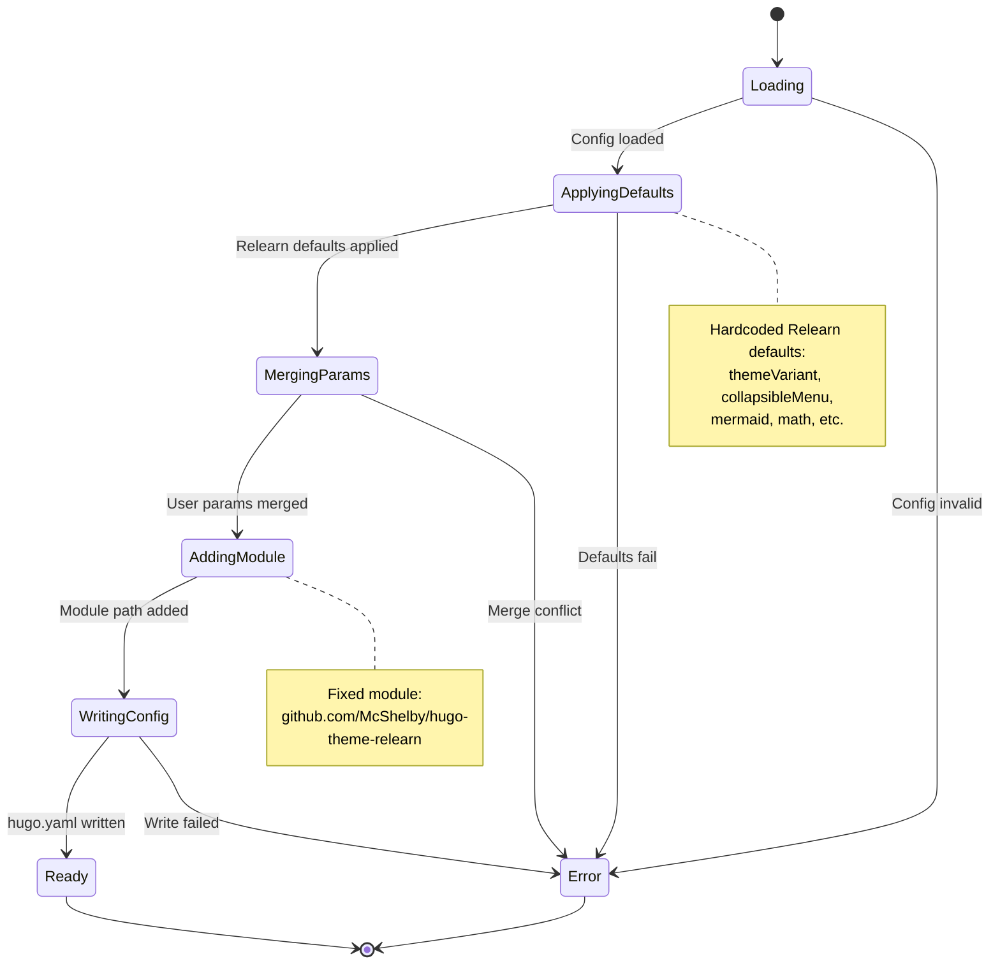
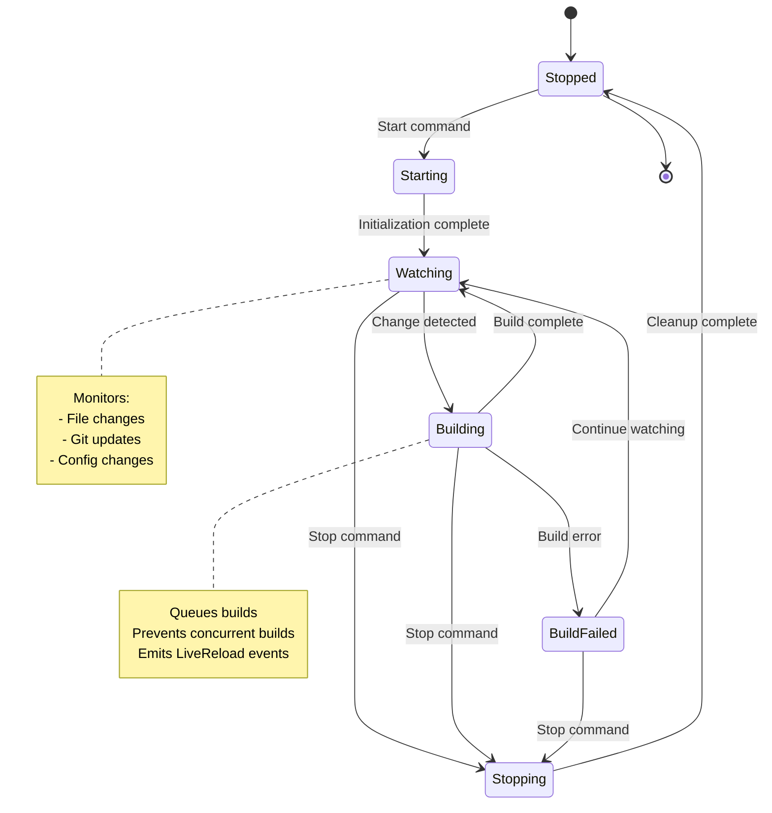
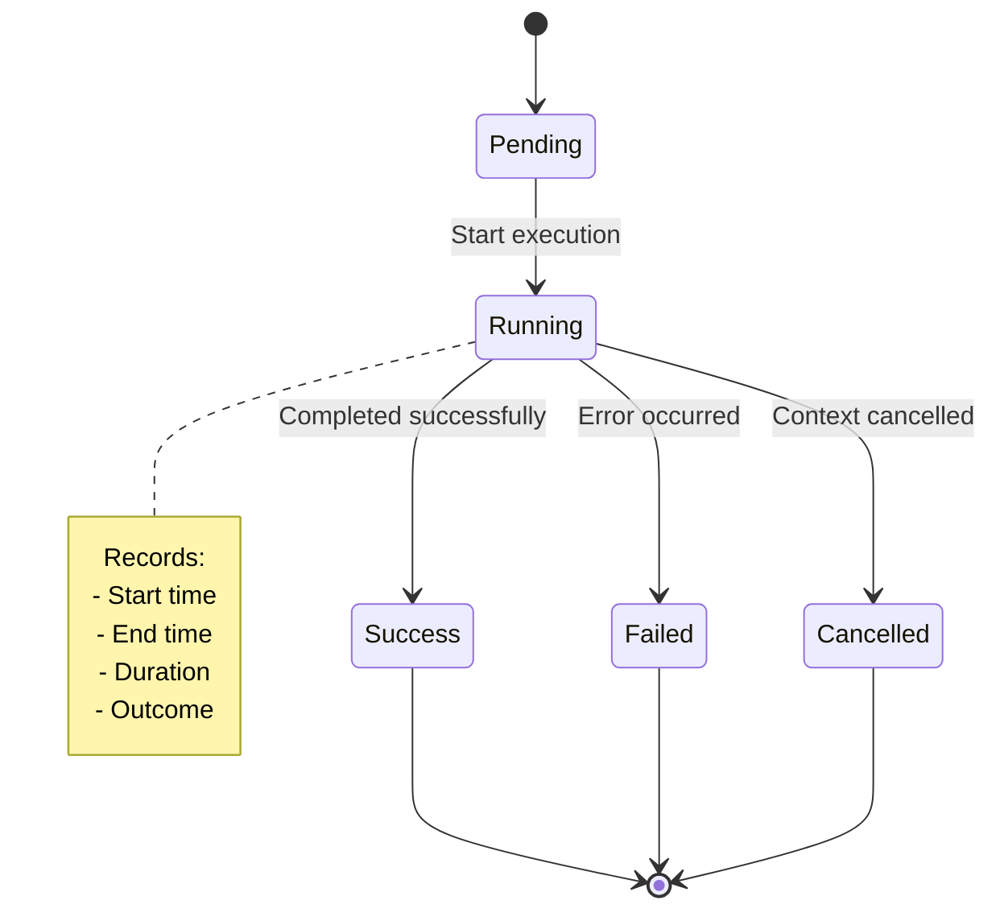
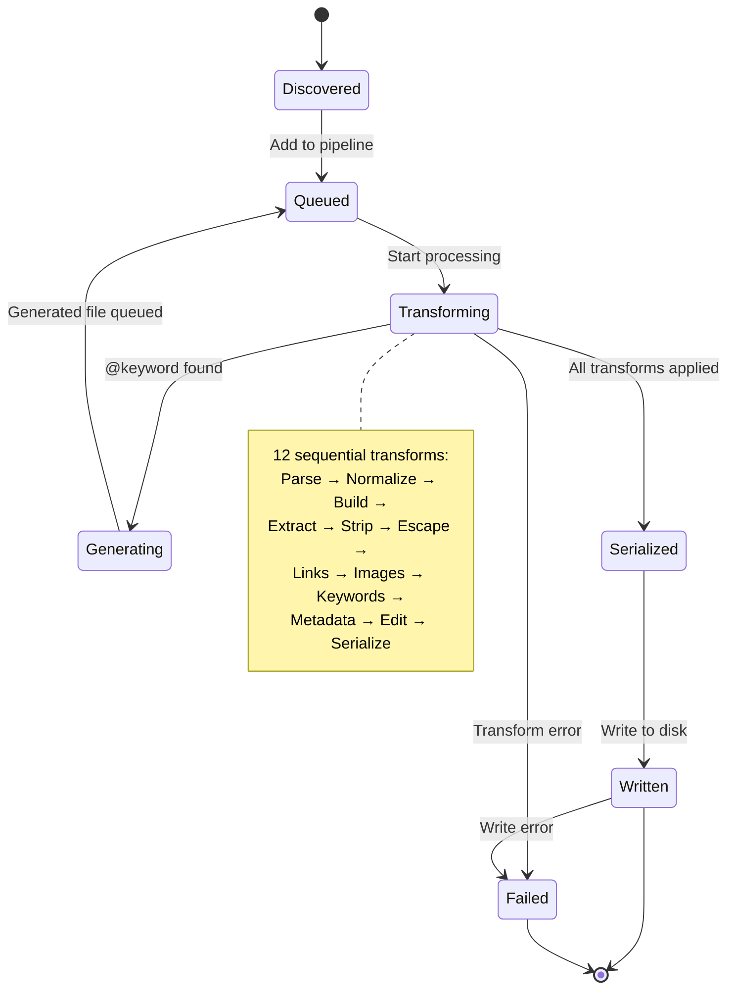

# State Machine Diagrams

This document shows the state transitions for builds, repositories, and theme configuration within DocBuilder.

**Last Updated:** January 4, 2026 - Reflects current implementation.

## Build State Machine

### Build States

**Idle**:
- No build in progress
- Waiting for user command or daemon trigger
- System resources available

**Preparing**:
- Creating output directory
- Initializing workspace
- Setting up Hugo structure
- Validating configuration

**Cloning**:
- Authenticating with forges
- Cloning or updating repositories
- Recording HEAD references
- Detecting changes for incremental builds

**Discovering**:
- Walking documentation paths
- Filtering markdown files
- Building DocFile list
- Computing documentation set hash

**Generating**:
- Applying Relearn theme defaults
- Merging user parameters
- Writing hugo.yaml
- Creating/updating go.mod

**Processing**:
- Running 12-step transform pipeline
- Processing each markdown file
- Generating static assets
- Writing to content/ directory

**Indexing**:
- Generating main index (_index.md)
- Creating repository indexes
- Generating section indexes

**Rendering**:
- Executing hugo command
- Capturing output
- Counting rendered pages
- Handling Hugo errors

**Complete**:
- Build succeeded
- Site generated in output directory
- Build report available
- Events emitted

**Failed**:
- Build encountered error
- Error classified and reported
- Partial output may exist
- Cleanup performed

### State Transitions

| From | To | Trigger | Condition |
|------|-----|---------|-----------|
| Idle | Preparing | Build command | User/daemon initiates |
| Preparing | Cloning | Output ready | Directories created |
| Cloning | Discovering | Repos cloned | All repos processed |
| Discovering | Generating | Docs found | Files discovered |
| Generating | Processing | Config generated | hugo.yaml written |
| Processing | Indexing | Content copied | All files transformed |
| Indexing | Rendering | Indexes created | All indexes generated |
| Rendering | Complete | Hugo finished | Hugo exit code 0 |
| Processing | Complete | Skip Hugo | render_mode=never |
| Any | Failed | Error | Unrecoverable error |
| Complete | Idle | Build finished | Report generated |
| Failed | Idle | Error handled | Cleanup complete |

### State Metadata

Each state records:
- **Entry time**: When state was entered
- **Exit time**: When state was exited
- **Duration**: Time spent in state
- **Outcome**: Success, failure, or skipped
- **Context**: State-specific data (e.g., files processed, repos cloned)

---

## Repository State Machine

### Repository States

**New**:
- Repository configuration loaded
- Not yet cloned
- No local copy exists

**Cloning**:
- Authenticating with credentials
- Executing git clone
- Downloading repository data

**Cloned**:
- Repository successfully cloned
- Local copy available
- HEAD reference recorded

**Checking**:
- Comparing HEAD references
- Computing documentation hash
- Detecting changes

**Unchanged**:
- No changes detected since last build
- Can skip clone/update
- Reuse previous clone

**Updating**:
- Executing git pull
- Fetching changes
- Updating local copy

**Updated**:
- Changes pulled successfully
- New HEAD reference recorded
- Ready for documentation discovery

**Ready**:
- Repository ready for processing
- Either freshly cloned or verified unchanged
- Documentation discovery can proceed

**Error**:
- Clone/update operation failed
- Network error, auth failure, or git error
- May be retryable

**Retrying**:
- Waiting before retry attempt
- Backoff delay applied
- Will retry clone or update

**Failed**:
- Maximum retries exceeded
- Permanent failure (e.g., repo not found)
- Repository skipped for this build

### State Transitions

| From | To | Trigger | Condition |
|------|-----|---------|-----------|
| New | Cloning | First build | No local copy |
| Cloning | Cloned | Success | Git clone succeeded |
| Cloned | Checking | Incremental build | Local copy exists |
| Checking | Unchanged | No changes | HEAD identical |
| Checking | Updating | Changes detected | HEAD differs |
| Updating | Updated | Success | Git pull succeeded |
| Updated | Ready | Verified | Integrity check passed |
| Unchanged | Ready | Skip update | No action needed |
| Cloning | Error | Failure | Network/auth error |
| Updating | Error | Failure | Git pull failed |
| Error | Retrying | Retryable | Transient error |
| Retrying | Cloning | Retry | Retry attempt |
| Retrying | Updating | Retry | Retry attempt |
| Error | Failed | Max retries | Permanent failure |

### Error Classification

**Retryable Errors**:
- Network timeout
- Connection refused
- DNS resolution failure
- Temporary server error (5xx)

**Permanent Errors**:
- Authentication failure
- Repository not found (404)
- Permission denied (403)
- Invalid repository URL

---

## Theme Configuration State Machine

### Theme Configuration States

**Loading**:
- Reading configuration file
- Parsing YAML structure
- Extracting Hugo parameters

**ApplyingDefaults**:
- Setting Relearn theme defaults
- Configuring theme variant
- Enabling features (Mermaid, math)
- Setting navigation options

**MergingParams**:
- Deep merging user parameters
- Resolving conflicts (user wins)
- Preserving user customizations

**AddingModule**:
- Configuring Hugo module path
- Setting module version
- Preparing module imports

**WritingConfig**:
- Serializing configuration to YAML
- Writing hugo.yaml file
- Creating/updating go.mod

**Ready**:
- Configuration complete
- hugo.yaml exists
- Hugo can be executed

**Error**:
- Configuration generation failed
- Invalid parameters
- Write permission denied

### Configuration Defaults Applied

**Theme Appearance**:
- `themeVariant`: `["auto", "zen-light", "zen-dark"]`
- `themeVariantAuto`: `["zen-light", "zen-dark"]`
- `showVisitedLinks`: `true`

**Navigation**:
- `collapsibleMenu`: `true`
- `alwaysopen`: `false`
- `disableBreadcrumb`: `false`
- `disableLandingPageButton`: `true`

**Features**:
- `mermaid.enable`: `true`
- `math.enable`: `true`
- `disableSearch`: `false` (search enabled)

**Footer**:
- `disableGeneratorVersion`: `false`
- `disableLanguageSwitchingButton`: `true`

**Content**:
- `disableShortcutsTitle`: `false`
- `disableTagHiddenPages`: `false`

---

## Daemon State Machine

### Daemon States

**Stopped**:
- Daemon not running
- No file watching active
- No HTTP server listening

**Starting**:
- Initializing file watchers
- Starting HTTP server
- Loading previous state
- Setting up build queue

**Watching**:
- Monitoring configured paths for changes
- Listening for HTTP requests
- Idle, ready to build

**Building**:
- Executing build pipeline
- Processing changes
- Generating updated site

**BuildFailed**:
- Build encountered error
- Error logged and reported
- Continue watching (don't exit)

**Stopping**:
- Shutting down watchers
- Closing HTTP server
- Persisting state
- Cleaning up resources

### Daemon Triggers

**Change Detection**:
- File system events (create, modify, delete)
- Git repository updates
- Configuration file changes

**HTTP Requests**:
- Manual build trigger via API
- Status check requests
- Preview page requests

**Signals**:
- SIGTERM / SIGINT (graceful shutdown)
- SIGHUP (reload configuration)

---

## Pipeline Stage State Machine

### Stage States

**Pending**:
- Stage queued for execution
- Dependencies not yet met
- Waiting for previous stages

**Running**:
- Stage function executing
- Resources allocated
- Progress tracked

**Success**:
- Stage completed successfully
- Output produced
- State updated

**Failed**:
- Stage encountered error
- Error classified and logged
- Build may abort (depending on error)

**Cancelled**:
- Context cancellation detected
- Stage execution stopped
- Cleanup performed

### Stage Execution Order

Stages execute in strict sequential order:
1. PrepareOutput → Running → Success
2. CloneRepos → Running → Success
3. DiscoverDocs → Running → Success
4. GenerateConfig → Running → Success
5. Layouts → Running → Success
6. CopyContent → Running → Success
7. Indexes → Running → Success
8. RunHugo → Running → Success (or skipped)

If any stage fails, subsequent stages don't execute.

---

## File Processing State Machine

### File Processing States

**Discovered**:
- File found during discovery
- Matches documentation filter criteria
- Added to file list

**Queued**:
- Waiting for transform pipeline
- In processor queue
- Dependencies resolved

**Transforming**:
- Currently executing transforms
- Sequential transform application
- State accumulates through pipeline

**Generating**:
- Special state when `@keywords` creates new files
- Generated files queued for processing
- Original file continues through pipeline

**Serialized**:
- All transforms complete
- Document serialized to bytes
- Front matter merged with content

**Written**:
- File written to Hugo content directory
- On disk in final form
- Ready for Hugo rendering

**Failed**:
- Transform or write error
- Error logged
- File skipped

---

## References

- [Pipeline Flow Diagrams](pipeline-flow.md)
- [Data Flow Diagrams](data-flow.md)
- [Component Interactions Diagrams](component-interactions.md)
- [High-Level System Architecture](high-level-architecture.md)
