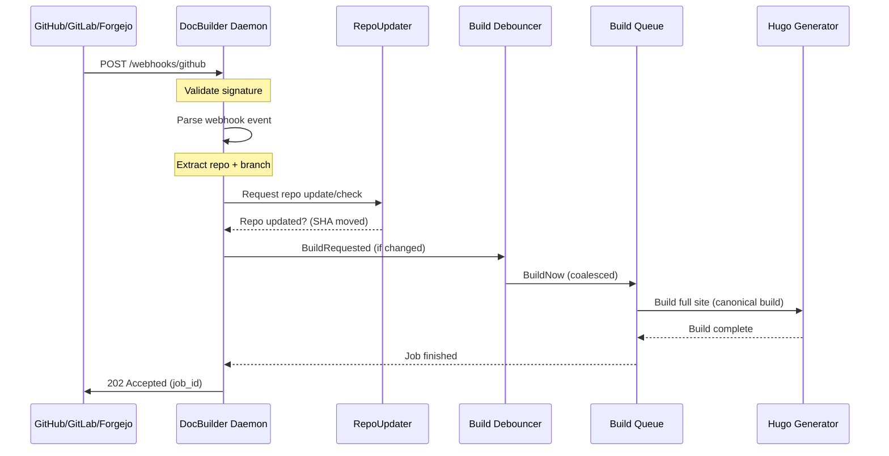

---
aliases:
  - /_uid/a32222c2-182c-47b4-9744-2a0dd1794367/
categories:
  - how-to
date: 2025-12-17T00:00:00Z
fingerprint: df2d0bb5f533c9c0872091ac2aa937620909ee2defc4e2245c943e7f52fca99e
lastmod: "2026-01-27"
tags:
  - webhooks
  - automation
  - ci-cd
title: Configure Webhooks for Automatic Rebuilds
uid: a32222c2-182c-47b4-9744-2a0dd1794367
---

# Configure Webhooks for Automatic Rebuilds

Webhooks allow DocBuilder to automatically rebuild documentation when changes are pushed to your repositories. This guide shows you how to configure webhooks for GitHub, GitLab, and Forgejo.

## Overview

When configured, DocBuilder:
1. Receives webhook events from your forge (GitHub/GitLab/Forgejo)
2. Validates the webhook signature for security
3. Parses the event to extract repository and branch information
4. Requests a repo update/check for the affected repository
5. If the repository changed, enqueues a rebuild of the **full site** (all configured repositories)
6. Returns an acknowledgment with a planned job ID

**Important**: A webhook does **not** narrow the site. DocBuilder may **update/check one repository**, but it still builds and publishes a coherent site from the daemon’s full repository set (“update one, rebuild all”).

**Important**: A webhook may not result in a build:
- If the webhook payload indicates no docs-relevant changes, DocBuilder can ignore the event.
- If DocBuilder determines the repository’s branch HEAD did not move, no build is requested.

**Note**: Webhook-triggered build requests default to “immediate” signals, but DocBuilder still coalesces work when a build is already running (at most one follow-up build is queued). You can change this behavior with `daemon.build_debounce.webhook_immediate`.

**Important**: For push-style webhooks that include changed file paths (GitLab/Forgejo/GitHub), DocBuilder only triggers a rebuild when at least one changed file is under one of the repository’s configured `paths` (defaults to `docs`). This avoids unnecessary rebuilds when unrelated code changes happen.

**Important**: Webhooks do **not** perform repository discovery. They only trigger builds for repositories DocBuilder already knows about (i.e. repositories already discovered by the daemon or explicitly configured).

To discover new repositories, rely on scheduled discovery (`daemon.sync.schedule`) or manually trigger discovery via the admin API: `POST http://your-docbuilder-host:<admin_port>/api/discovery/trigger`.

## Configuration

### 0. Understanding Port Isolation

**Important**: DocBuilder runs webhooks on a **separate HTTP server** and port from your documentation. This means:
- **Documentation** is served on `docs_port` (default: 8080)
- **Webhooks** are received on `webhook_port` (default: 8081)
- **No collision is possible** - they're completely isolated servers

Example URLs:
- Documentation: `http://your-server:8080/docs/guide/`
- Webhooks: `http://your-server:8081/webhooks/github` (default path for a GitHub forge)

See [Webhook and Documentation Isolation](../explanation/webhook-documentation-isolation.md) for detailed architecture information.

### 1. Add Webhook Configuration to Your Forge

In your `config.yaml`, add webhook configuration to each forge.

Notes:
- Webhook routing is per **configured forge instance** (`forges[].name`).
- The webhook endpoint path can be customized per forge via `forges[].webhook.path`.
- If `forges[].webhook.path` is omitted, DocBuilder uses a default path of `/webhooks/<forge-type>` (e.g. `/webhooks/github`).
- Webhooks are not supported for `type: local`.

```yaml
forges:
  - name: github
    type: github
    base_url: "https://github.com"
    api_url: "https://api.github.com"
    auth:
      type: token
      token: "${GITHUB_TOKEN}"
    webhook:
      secret: "${GITHUB_WEBHOOK_SECRET}"  # Shared secret for signature validation
      path: "/webhooks/github"            # Endpoint path (optional, default shown)
      events:                             # Events to listen for
        - push
        - repository
  
    - name: gitlab
    type: gitlab
    base_url: "https://gitlab.com"
    api_url: "https://gitlab.com/api/v4"
    auth:
      type: token
      token: "${GITLAB_TOKEN}"
    webhook:
      secret: "${GITLAB_WEBHOOK_SECRET}"
      path: "/webhooks/gitlab"
      events:
        - push
        - tag_push
  
    - name: forgejo
    type: forgejo
    base_url: "https://git.home.luguber.info"
    api_url: "https://git.home.luguber.info/api/v1"
    auth:
      type: token
      token: "${FORGEJO_TOKEN}"
    webhook:
      secret: "${FORGEJO_WEBHOOK_SECRET}"
      path: "/webhooks/forgejo"
      events:
        - push
```

If you run multiple forges of the same type, give them distinct names and distinct paths:

```yaml
forges:
  - name: company-github
    type: github
    base_url: "https://github.com"
    api_url: "https://api.github.com"
    auth:
      type: token
      token: "${GITHUB_TOKEN}"
    webhook:
      secret: "${COMPANY_GITHUB_WEBHOOK_SECRET}"
      path: "/webhooks/company-github"  # custom per-instance path
```

### 2. Configure Daemon HTTP Ports

DocBuilder runs **four separate HTTP servers** on different ports:

```yaml
daemon:
  http:
    docs_port: 8080       # Documentation server (public)
    webhook_port: 8081    # Webhook receiver (forge access only)
    admin_port: 8082      # Admin API (internal only)
    livereload_port: 8083 # Live reload SSE (optional)
```

**Port Separation Benefits:**
- ✅ Webhooks cannot interfere with documentation serving
- ✅ Different firewall rules for each service
- ✅ Separate access controls (public docs, restricted webhooks)
- ✅ Independent scaling and monitoring

**Port Configuration Rules:**
- All ports must be unique (daemon fails to start if duplicates detected)
- Use sequential ports for clarity (8080, 8081, 8082, 8083)
- Ports can be customized but must remain distinct

### 3. Set Environment Variables

Create a `.env` file or `.env.local` file with your webhook secrets:

```bash
# GitHub webhook secret
GITHUB_WEBHOOK_SECRET=your-github-webhook-secret-here

# GitLab webhook secret
GITLAB_WEBHOOK_SECRET=your-gitlab-webhook-secret-here

# Forgejo webhook secret
FORGEJO_WEBHOOK_SECRET=your-forgejo-webhook-secret-here
```

**Security Note**: Use strong, randomly generated secrets. You can generate one with:
```bash
openssl rand -hex 32
```

## Forge-Specific Setup

### GitHub

1. Go to your repository settings → Webhooks → Add webhook
2. Set **Payload URL** to your configured webhook path, e.g. `http://your-docbuilder-host:8081/webhooks/github`
3. Set **Content type** to: `application/json`
4. Set **Secret** to the same value as `GITHUB_WEBHOOK_SECRET`
5. Select events:
   - **Push events** (for code pushes)
   - **Repository events** (for repo changes)
6. Ensure **Active** is checked
7. Click **Add webhook**

**Test**: Push a commit to your repository and check the webhook delivery in GitHub settings.

### GitLab

1. Go to your project settings → Webhooks
2. Set **URL** to your configured webhook path, e.g. `http://your-docbuilder-host:8081/webhooks/gitlab`
3. Set **Secret token** to the same value as `GITLAB_WEBHOOK_SECRET`
4. Select trigger events:
   - **Push events**
   - **Tag push events** (optional)
5. Uncheck **SSL verification** if using HTTP (not recommended for production)
6. Click **Add webhook**

**Test**: Click "Test" next to your webhook and select "Push events".

**System Hooks vs Project Webhooks**:
- DocBuilder is designed primarily for **Project Webhooks**, which typically send `X-Gitlab-Event: Push Hook` / `Tag Push Hook`.
- If you configure a **GitLab System Hook**, GitLab sends `X-Gitlab-Event: System Hook` even when the payload is a normal push (with `object_kind: push`).
- DocBuilder supports System Hook payloads by dispatching based on `object_kind` / `event_name` (push and tag push). If you see logs mentioning `event="System Hook"`, verify your GitLab hook type and that you’re sending `object_kind: push` (or use a Project Webhook instead).

### Forgejo (Gitea)

1. Go to your repository settings → Webhooks → Add webhook → Gitea
2. Set **Target URL** to your configured webhook path, e.g. `http://your-docbuilder-host:8081/webhooks/forgejo`
3. Set **HTTP Method** to: `POST`
4. Set **POST Content Type** to: `application/json`
5. Set **Secret** to the same value as `FORGEJO_WEBHOOK_SECRET`
6. Select trigger events:
   - **Push**
   - **Repository** (optional)
7. Ensure **Active** is checked
8. Click **Add webhook**

**Test**: Push a commit and check the webhook deliveries in Forgejo.

## Webhook Endpoints

DocBuilder provides webhook endpoints based on your configured forges.

- If `forges[].webhook.path` is set, that exact path is used.
- If it is not set, a default path of `/webhooks/<forge-type>` is used.

| Default Endpoint | Forge Type | Signature Header | Event Header |
|------------------|-----------|------------------|--------------|
| `/webhooks/github` | GitHub | `X-Hub-Signature-256` | `X-GitHub-Event` |
| `/webhooks/gitlab` | GitLab | `X-Gitlab-Token` | `X-Gitlab-Event` |
| `/webhooks/forgejo` | Forgejo | `X-Hub-Signature-256` | `X-Forgejo-Event` or `X-Gitea-Event` |

`/webhook` is a generic acknowledgment endpoint and does not trigger builds.

## Webhook Flow



## Webhook Response

Successful webhook receives return:

```json
{
  "status": "received",
  "timestamp": "2025-12-17T10:30:00Z",
  "event": "push",
  "source": "github",
  "build_job_id": "webhook-1734433800"
}
```

If no matching repository is found, the webhook is still acknowledged but no build is triggered.

## Verification

### Check Webhook Logs

Monitor DocBuilder daemon logs for webhook events:

```bash
# Successful webhook with build trigger
INFO Webhook signature validated forge=company-github
INFO Webhook matched repository repo=docbuilder full_name=inful/docbuilder branch=main
INFO Webhook build triggered job_id=webhook-1734433800 repo=inful/docbuilder branch=main target_count=1

# Webhook received but no matching repo
WARN No matching repositories found for webhook repo_full_name=unknown/repo branch=main
```

### Check Build Queue

Check the build queue via the admin API:

```bash
curl http://localhost:8082/api/queue/status
```

Look for jobs with `type: "webhook"` and verify the `repositories` field contains only the triggered repository.

## Troubleshooting

### Signature Validation Failed

```
WARN Webhook signature validation failed forge=github event=push
```

**Solution**: Ensure the `webhook.secret` in your config matches the secret configured in your forge.

### No Matching Repository

```
WARN No matching repositories found for webhook repo_full_name=owner/repo branch=main
```

**Solution**: 
- Verify the repository is configured in your `config.yaml`
- Check that the repository URL matches the webhook source
- Ensure the branch matches if you have branch-specific configs

### Webhook Not Received

**Check**:
1. Firewall allows connections to webhook_port (default 8081)
2. DocBuilder daemon is running
3. Forge can reach your DocBuilder instance (check forge webhook delivery logs)

## Security Considerations

### Port Isolation (Primary Security)

Webhooks run on a **separate HTTP server** (port 8081 by default), completely isolated from documentation (port 8080). This provides:
- **Zero collision risk** between webhooks and documentation
- **Independent access control** per service
- **Network-level separation** via firewall rules

### Access Control Best Practices

1. **Always use webhook secrets** for signature validation
2. **Use HTTPS in production** to encrypt webhook payloads
3. **Restrict webhook port access** using firewall rules:
   ```bash
   # Allow docs publicly
   iptables -A INPUT -p tcp --dport 8080 -j ACCEPT
   
   # Allow webhooks only from forge IPs
   iptables -A INPUT -p tcp --dport 8081 -s <github-ip-range> -j ACCEPT
   iptables -A INPUT -p tcp --dport 8081 -j DROP  # Block others
   
   # Allow admin only from internal network
   iptables -A INPUT -p tcp --dport 8082 -s 10.0.0.0/8 -j ACCEPT
   iptables -A INPUT -p tcp --dport 8082 -j DROP
   ```
4. **Rotate webhook secrets** periodically
5. **Monitor webhook logs** for unusual activity
6. **Use reverse proxy** for additional isolation (subdomains recommended)

## Advanced Configuration

### Custom Webhook Port

```yaml
daemon:
  http:
    webhook_port: 9000  # Custom port
```

Update your forge webhook URLs accordingly.

### Event Filtering

Configure which events trigger builds:

```yaml
webhook:
  events:
    - push          # Code pushes
    - tag_push      # Tag creation (GitLab/Forgejo)
    - repository    # Repository events (create, delete, rename)
```

**Note**: `webhook.events` is currently treated as informational/forge-side configuration. DocBuilder validates and parses the incoming event and triggers a build when it can extract a repository + branch that matches your configured repositories.

## Related Documentation

- [Webhook and Documentation Isolation](../explanation/webhook-documentation-isolation.md) - Architecture and collision prevention
- [Getting Started](../tutorials/getting-started.md) - Introduction to DocBuilder
- [Configuration Reference](../reference/configuration.md) - Complete configuration guide
