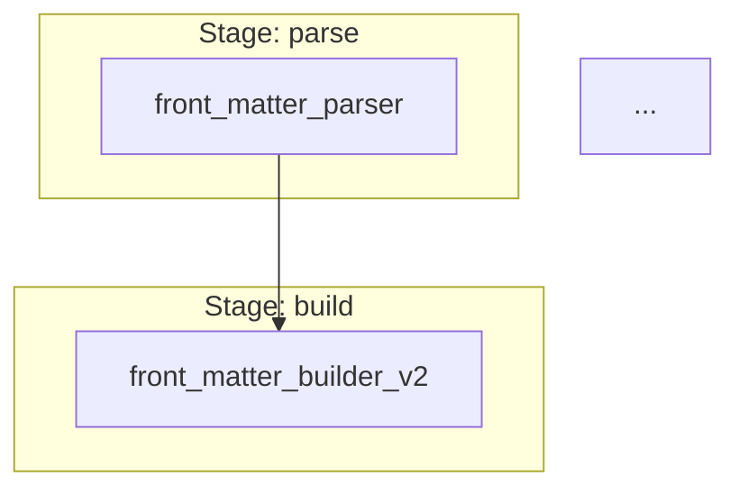

---
categories:
    - reference
date: 2025-12-15T00:00:00Z
id: 4592041a-70ac-4bc5-9626-70c2321a1f8b
tags:
    - pipeline
    - visualization
    - diagrams
title: Pipeline Visualization
---

# Pipeline Visualization

The `docbuilder visualize` command provides multiple ways to visualize the transform pipeline, making it easy to understand execution order, stage grouping, and dependency relationships.

## Quick Start

```bash
# View pipeline in terminal (default text format)
docbuilder visualize

# Generate Mermaid diagram for documentation
docbuilder visualize -f mermaid > docs/pipeline.md

# Create DOT file for rendering
docbuilder visualize -f dot -o pipeline.dot
dot -Tpng pipeline.dot -o pipeline.png

# Export as JSON for tooling
docbuilder visualize -f json -o pipeline.json

# List available formats
docbuilder visualize --list
```

## Output Formats

### Text (Default)

Human-readable ASCII art with boxes, arrows, and dependency indicators.

```
Transform Pipeline Visualization
=================================

┌─ Stage 1: parse
│
│ └── [front_matter_parser]
│
↓
┌─ Stage 2: build
│
│ └── [front_matter_builder_v2]
│        ⤷ depends on: front_matter_parser
│
↓
...
```

**Best for:** Quick terminal inspection, debugging, documentation

### Mermaid

GitHub and GitLab compatible diagram syntax.

````markdown

````

**Best for:** README files, GitHub/GitLab wikis, documentation sites

**Render automatically on:** GitHub, GitLab, Notion, Obsidian, many markdown viewers

### DOT (Graphviz)

Professional graph visualization format.

```dot
digraph TransformPipeline {
    rankdir=TB;
    node [shape=box, style=rounded];

    subgraph cluster_0 {
        label="Stage: parse";
        style=filled;
        color=lightgrey;
        "front_matter_parser";
    }
    
    "front_matter_parser" -> "front_matter_builder_v2";
    ...
}
```

**Best for:** High-quality images, presentations, printed documentation

**Render with:**
```bash
# PNG
dot -Tpng pipeline.dot -o pipeline.png

# SVG
dot -Tsvg pipeline.dot -o pipeline.svg

# PDF
dot -Tpdf pipeline.dot -o pipeline.pdf
```

### JSON

Structured machine-readable format.

```json
{
  "transforms": [
    {
      "name": "front_matter_parser",
      "stage": "parse",
      "order": 1,
      "dependencies": {
        "mustRunAfter": [],
        "mustRunBefore": []
      }
    },
    ...
  ],
  "totalTransforms": 9,
  "totalStages": 7
}
```

**Best for:** Tooling, analysis scripts, CI/CD pipelines, monitoring dashboards

## Use Cases

### 1. Understanding Pipeline Flow

View the complete transform execution order:

```bash
docbuilder visualize
```

This shows:
- All 7 stages in order
- Transforms within each stage
- Dependency relationships
- Total transform count

### 2. Debugging Transform Issues

When a transform isn't running as expected:

```bash
docbuilder visualize | grep my_transform
```

Check:
- Which stage it's in
- What it depends on
- What depends on it

### 3. Documenting Architecture

Add pipeline diagram to your README:

```bash
docbuilder visualize -f mermaid >> README.md
```

The Mermaid diagram will render automatically on GitHub/GitLab.

### 4. Creating Presentations

Generate high-quality pipeline diagram:

```bash
docbuilder visualize -f dot -o pipeline.dot
dot -Tpng -Gdpi=300 pipeline.dot -o pipeline-hires.png
```

### 5. CI/CD Integration

Verify pipeline configuration in CI:

```bash
#!/bin/bash
docbuilder visualize -f json > pipeline.json
# Parse JSON to validate expected transforms exist
jq '.transforms[].name' pipeline.json | grep "my_required_transform"
```

### 6. Monitoring Pipeline Changes

Track pipeline evolution over time:

```bash
# Generate baseline
docbuilder visualize -f json > pipeline-baseline.json

# After changes
docbuilder visualize -f json > pipeline-current.json

# Compare
diff pipeline-baseline.json pipeline-current.json
```

## CLI Reference

### Flags

- `-f, --format` - Output format: `text`, `mermaid`, `dot`, `json` (default: `text`)
- `-o, --output` - Write to file instead of stdout
- `-l, --list` - List available formats and exit

### Examples

```bash
# Basic usage (text to stdout)
docbuilder visualize

# Specific format
docbuilder visualize -f mermaid
docbuilder visualize -f dot
docbuilder visualize -f json

# Write to file
docbuilder visualize -o pipeline.txt
docbuilder visualize -f mermaid -o docs/pipeline.md
docbuilder visualize -f dot -o pipeline.dot
docbuilder visualize -f json -o pipeline.json

# Get help
docbuilder visualize --list
docbuilder visualize --help
```

## Understanding the Output

### Stages

Transforms are organized into 7 stages that execute in order:

1. **parse** - Extract and parse source content
2. **build** - Generate base metadata
3. **enrich** - Add computed fields
4. **merge** - Combine/merge data
5. **transform** - Modify content
6. **finalize** - Post-process
7. **serialize** - Output generation

### Dependencies

Two types of dependencies control execution order within stages:

- **MustRunAfter** (⤷) - This transform depends on another
- **MustRunBefore** (⤶) - Another transform depends on this

Example:
```
└── [edit_link_injector_v2]
       ⤷ depends on: front_matter_builder_v2
```

Means `edit_link_injector_v2` runs after `front_matter_builder_v2`.

### Execution Order

Transforms execute in order:

1. Grouped by stage (parse → build → ... → serialize)
2. Within each stage, ordered by dependencies (topological sort)
3. If no dependencies, alphabetical order

## Integration with Other Tools

### With `jq` (JSON processing)

```bash
# Count transforms per stage
docbuilder visualize -f json | jq '.transforms | group_by(.stage) | map({stage: .[0].stage, count: length})'

# List all dependencies
docbuilder visualize -f json | jq '.transforms[] | {name: .name, deps: .dependencies.mustRunAfter}'

# Find transforms with no dependencies
docbuilder visualize -f json | jq '.transforms[] | select(.dependencies.mustRunAfter == [])'
```

### With `graphviz` (DOT rendering)

```bash
# Create various formats
docbuilder visualize -f dot | dot -Tpng > pipeline.png
docbuilder visualize -f dot | dot -Tsvg > pipeline.svg
docbuilder visualize -f dot | dot -Tpdf > pipeline.pdf

# Different layouts
docbuilder visualize -f dot | dot -Tpng -Grankdir=LR > pipeline-horizontal.png
```

### With `grep` (Text searching)

```bash
# Find specific transform
docbuilder visualize | grep -A 3 "my_transform"

# Show only dependencies
docbuilder visualize | grep "depends on"

# Count transforms per stage
docbuilder visualize | grep "Stage" | wc -l
```

## Troubleshooting

### "No transforms registered"

The visualize command needs transforms to be registered. This should work automatically, but if you see this error:

1. Ensure you're running from the project root
2. Check that imports are working correctly
3. Try running a build first: `docbuilder build` then `docbuilder visualize`

### Mermaid diagram not rendering

If your Mermaid diagram doesn't render on GitHub/GitLab:

1. Ensure you have the triple backticks with `mermaid` language identifier
2. Check the syntax is valid at https://mermaid.live
3. GitHub/GitLab must have Mermaid support enabled (it's usually on by default)

### DOT rendering issues

If `dot` command is not found:

```bash
# Ubuntu/Debian
sudo apt-get install graphviz

# macOS
brew install graphviz

# Fedora
sudo dnf install graphviz
```

## Advanced Usage

### Custom Styling for DOT

Modify the DOT output for custom styling:

```bash
docbuilder visualize -f dot -o pipeline.dot

# Edit pipeline.dot to add:
# - node [shape=ellipse, color=blue];
# - edge [color=red, style=dashed];

dot -Tpng pipeline.dot -o styled-pipeline.png
```

### Pipeline Diff Script

Track pipeline changes over time:

```bash
#!/bin/bash
# save-pipeline-snapshot.sh
DATE=$(date +%Y%m%d)
docbuilder visualize -f json > "pipeline-snapshots/$DATE.json"
git add "pipeline-snapshots/$DATE.json"
git commit -m "Pipeline snapshot $DATE"
```

### Documentation Generator

Auto-generate pipeline documentation:

```bash
#!/bin/bash
# generate-pipeline-docs.sh
echo "# Transform Pipeline" > docs/pipeline.md
echo "" >> docs/pipeline.md
echo "Generated: $(date)" >> docs/pipeline.md
echo "" >> docs/pipeline.md
docbuilder visualize -f mermaid >> docs/pipeline.md
echo "" >> docs/pipeline.md
echo "## Transform Details" >> docs/pipeline.md
docbuilder visualize >> docs/pipeline.md
```

## See Also

- [Transform Validation](./transform-validation.md) - Validate pipeline before running
- [Add Content Transforms](../how-to/add-content-transforms.md) - Create custom transforms
- [Content Transforms Reference](./content-transforms.md) - Technical architecture
